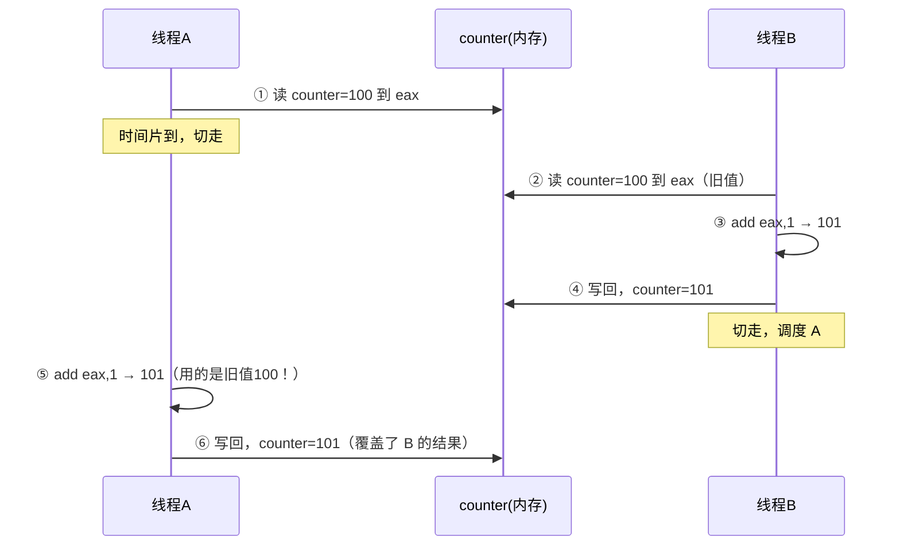

# C++ 多线程入门：创建线程、加锁、计数

> 从线程创建到竞态解决，本文用代码跑通多线程编程的四个核心问题：线程怎么开、生命周期怎么管、共享数据为什么出错、mutex 和 atomic 怎么选。
>
> **前置知识**：有C++语言基础，有 g++ 编译器基础。本人刚好对g++ 的安装和基本使用发表过相关博客，详情请点击 [g++ 从入门到忘记](https://blog.csdn.net/rr666888/article/details/162645027)

---

## 一、为什么需要多线程

单线程程序像一个人在干活——干完一件才能干下一件。但现实中很多事是可以**同时进行**的：

- 主线程处理 UI 事件，后台线程下载文件
- 服务器主线程等新连接，工作线程处理已连接的请求
- 一个程序同时做多件事：边读取数据边计算边写结果

C++11 之前，C++ 没有标准的多线程库，得用操作系统的 API（Linux 的 pthread、Windows 的 CreateThread），不同平台代码还不一样。C++11 引入了 `std::thread`，一套代码跨平台编译。

---

## 二、创建线程

```cpp
#include <iostream>
#include <thread>    

void hello(){
    std::cout << "Hello from thread!\n";
}

int main(){
    std::thread t(hello);   // 创建线程，执行 hello 函数
    t.join();               // 主线程等子线程t运行完
    std::cout << "Hello from main!\n";
    return 0;
}
```

编译运行（**记住加 `-pthread`**）：

>  可能这里会有疑问，为什么有 `#include <thread>` 还要加 `-pthread`？
> 
> `#include <thread>` 是**编译时**告诉编译器"std::thread 类的具体结构"，而 `-pthread` 是**链接时**告诉链接器"去链接 pthread 库的代码"。`std::thread` 底层封装的是 Linux 的 pthread 库，没有 `-pthread` 链接阶段会报 `undefined reference to pthread_create` 错误——头文件让编译器认识类型，链接选项让链接器找到实现。

```bash
g++ -std=c++17 -pthread main.cpp -o test
./test
```

输出：

```
Hello from thread!
Hello from main!
```

### 2.1 用 lambda 创建

实际写代码时，很少会单独写一个函数传给 thread，更常用的是 **lambda 表达式**——把要干的事直接写在创建线程的地方。  
好处是：不用来回翻代码看函数定义在哪、能直接捕获周围的变量。

```cpp
std::thread t([&](){
    std::cout << "lambda thread\n";
});
```

`[&]` 意思是"捕获外面所有变量的引用"，这样 lambda 里就能访问 main 里的变量了。  
但是，引用不是万能的：
>  **lambda 按引用捕获的陷阱**
>
> ```cpp
> #include <unistd.h>   // sleep
> 
> int main(){
>     std::thread t;
>     {
>         int a = 42;
>         t = std::thread([&a](){
>             sleep(3);            
>             std::cout << a;      // 3 秒后跑到这里，但 a 已经销毁了！
>         });
>     }
>     // ← a 已经没了（出作用域自动销毁）
>     t.join();  // 线程t还在跑，访问了不存在的 a，导致程序崩溃
> }
> ```
>
> `[&]` 捕获的是引用，不是拷贝。如果线程还没跑完变量先销毁了，访问它就是**悬空引用**——效果和野指针类似。
>
> **怎么避免？**
> 1. 优先用 `[=]` 按值捕获，把变量拷贝一份给线程，不依赖原变量的生命周期
> 2. 如果用 `[&]`，必须确保线程在变量销毁前结束（在 `}` 前先 `join()`）
>
> 多线程场景里"确保线程比变量活得短"这很难控制，所以 lambda 开线程时**优先用 `[=]` 按值捕获**，明确知道线程不会比变量活得长时才用 `[&]`。

**补充：std::thread 还支持这些创建方式**（了解即可，lambda 最常用）

```cpp
// 方式1：仿函数——重载 operator() 使对象可调用
struct Worker{
    void operator()(){ ... }
};
std::thread t(Worker{});

// 方式2：成员函数
class Task{
public:
    void run(){  ...  }   
};
Task obj;
std::thread t(&Task::run, &obj);
// 第一个参数是成员函数的地址 &Task::run
// 第二个参数是哪个对象的这个函数（obj）
// 线程里实际执行的是 obj.run()

// 方式3：std::bind
auto f = std::bind([](int a, int b){  ...  }, 42, 100);
std::thread t(f);
// 线程里执行 f() 等价于执行 lambda(42, 100)
```

### 2.2 传参数

```cpp
void work(int n, const std::string& s){
    std::cout << n << " " << s << std::endl;
}

int main(){
    std::thread t(work, 42, "hello");  // 传参给 work(42, "hello")
    t.join();
}
```

>  传引用时要加 `std::ref`，否则 thread 默认按值复制：
> ```cpp
> void add(int& x){ x++; }
> int a = 0;
> std::thread t(add, std::ref(a));  // 不加 std::ref 编译不过
> ```

---

## 三、线程生命周期——join 和 detach

### 3.1 忘记join和detach...

我刚学多线程时总会犯这个错：

```cpp
int main(){
    std::thread t([]{ std::cout << "work\n"; });
    // 忘记调用 join和detach
    return 0;
}
```

std::thread 的析构函数会检查线程是否还"可 join"。只要没调过 join 也没调过 detach，线程就处于"可 join"状态——不管它跑没跑完。可 join的线程在析构时不会被默默托管，C++ 标准的选择是直接调用 std::terminate() 终止程序，然后逼你做出明确选择。

对比一下正确的写法：

```cpp
int main(){
    std::thread t([]{ std::cout << "work\n"; });
    t.join();   // 等它跑完再退出，程序正常结束
    return 0;
}
```

**二选一：**

| 方式 | 行为 | 场景 |
|:----|:-----|:-----|
| `t.join()` | 主线程阻塞，等 t 跑完再继续 | 需要线程的结果，或者必须等它运行完 |
| `t.detach()` | 放手让 t 在后台跑，不再关联 | 日志、定时器等 不影响主流程的工作 |


### 3.2 理解 RAII
 
这里其实涉及 C++ 一个非常重要的设计思想——**RAII（资源获取即初始化）**。作者后续会针对 RAII 机制单独出一篇详细讲解，这里先简单了解：

`std::thread` 本身就是一个 RAII 对象——它管理线程这个资源的生命周期。只是它的设计者选择在你不做决定时直接 terminate，逼你必须在 join 和 detach 之间选一个，而不是默默帮你 detach 让线程在后台失控。


到此你学会了创建线程和管理它的生命周期。但多个线程跑起来之后，如果它们要**共享数据**，就会引出新的问题——一个线程正在写、另一个线程同时读，结果会怎样？下面就来复现这个经典场景。

---

## 四、经典问题：竞态条件

### 4.1 问题复现

```cpp
#include <iostream>
#include <thread>
#include <mutex>
#include <atomic>

int counter = 0;   // 共享变量

int main(){
    std::thread t1([&](){ for(int i=0;i<100000;i++) counter++; });
    std::thread t2([&](){ for(int i=0;i<100000;i++) counter++; });
    std::thread t3([&](){ for(int i=0;i<100000;i++) counter++; });
    std::thread t4([&](){ for(int i=0;i<100000;i++) counter++; });

    t1.join(); t2.join(); t3.join(); t4.join();

    std::cout << "结果=" << counter << " (期望=400000)" << std::endl;
    return 0;
}
```

我的运行结果：

```
结果=255517 (期望=400000)
```

每次都跑出不同的数，永远小于 400000。**这就是竞态条件。**

### 4.2 为什么——从 CPU 指令看

`counter++` 不是一条操作，而是三步：

```asm
mov eax, [counter]    ; ① 把 counter 的值读到寄存器
add eax, 1            ; ② 寄存器 +1
mov [counter], eax    ; ③ 写回内存
```

线程切换可能发生在任意两步之间。比如：

```
线程A: mov eax, [counter]      eax=100
        时间片到，A被切走 
线程B: mov eax, [counter]      eax=100（还是旧值）
线程B: add eax, 1              eax=101
线程B: mov [counter], eax      counter=101
        线程A被调度回来 
线程A: add eax, 1              eax=101（用的是之前读的100！）
线程A: mov [counter], eax      counter=101
```

两个线程各加一次，期望 102，实际只加了 1。**一次更新被丢失了。**

用时序图看更直观：



### 4.3 解法一：std::mutex

```cpp
#include <mutex>

int counter = 0;
std::mutex mtx;                    // 锁

// 每个线程的循环里：
{
    std::lock_guard<std::mutex> guard(mtx);  // lock
    counter++;                                // 安全操作
}                                             // 自动 unlock
```

锁的原理：当某一线程持有该锁时，其他线程得不到锁，无法进入临界区，只能等待持有锁的线程释放锁，才能继续竞争锁并进入临界区。

加了锁之后，结果：
```
[mutex] 结果=400000 (期望=400000)
```

代价是慢——每次加锁解锁涉及操作系统调度，而其他线程只能阻塞等待。

>  实际开发中不要锁整个大循环，锁只需要保护的那一两行就好。

### 4.4 解法二：std::atomic（硬件指令）

如果只是对单个整数做加减，有更轻量的方案：

```cpp
#include <atomic>

std::atomic<int> counter(0);

// 循环里：
counter.fetch_add(1);  
```

`fetch_add(1)` 在底层是一条 CPU 指令：

```asm
lock xadd [counter], 1   ; 读加写，一条指令，不可打断
```

`lock` 前缀会通知 CPU：这条指令执行期间，禁止其他核心访问这个内存地址。

结果同样正确：

```
[atomic] 结果=400000 (期望=400000)
```

而且比 mutex 快很多——没有系统调用带来的用户态/内核态切换开销，没有阻塞等待，纯用户态的一条硬件指令即可完成。

### 4.5 三版对比

| 版本 | 结果 | 说明 |
|:----|:----|:-----|
| 不加锁 | 255517  | 竞态，每次跑出来不一样 |
| +mutex | 400000  | 正确，但慢 |
| +atomic | 400000  | 正确，比 mutex 快 |

>  `atomic` 只适合保护**单个变量**。如果需要保护多步操作，还是得用 `mutex`。

---

## 五、总结

### 线程生命周期

- 创建：`std::thread t(func)` 或 `std::thread t([&]{...})`，构造后立即开始执行
- 等待：`t.join()`，主线程阻塞直到子线程执行完毕，若不调用则析构时触发 terminate
- 分离：`t.detach()`，线程与 thread 对象脱离关联，转为后台独立运行，需保证其访问的变量生命周期覆盖线程执行期间
- 引用传参：`std::thread(t, std::ref(x))`，thread 默认按值复制参数，传递引用须用 std::ref 包装

### 竞态解决方案

| 场景 | 方案 | 原理说明 |
|:----|:----|:---------|
| 单变量原子操作 | `atomic<T>` | 通过 CPU 原子指令（如 x86 lock xadd）实现，无系统调用 |
| 多变量或复合逻辑 | `mutex` + `lock_guard` | 互斥锁保证临界区互斥访问，lock_guard 以 RAII 方式管理锁生命周期 |
| 异常安全保护 | `lock_guard` | 构造时加锁、析构时解锁，作用域退出时自动释放 |

`count++` 并非原子操作：其底层对应三条汇编指令（读→修改→写回），线程调度可能发生在任意两条指令之间，导致更新丢失。

### 编译

```bash
g++ -std=c++17 -pthread main.cpp -o test
```

看到这里，开头提出的几个问题应该都有答案了：为什么需要多线程、怎么创建和等待线程、count++ 为什么会丢数据、mutex 和 atomic 分别怎么用。由于多线程并发编程内容繁多，本文只是讲解最基础的部分，后续会继续推进自旋锁、死锁、条件变量等内容，逐步完善，推进多线程系列。

本人能力有限，文章如有错误或遗漏的地方，欢迎指正。
