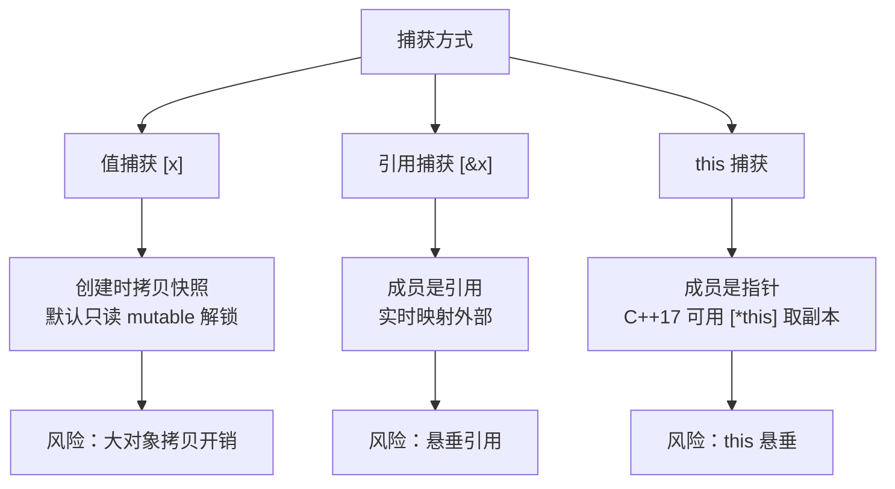
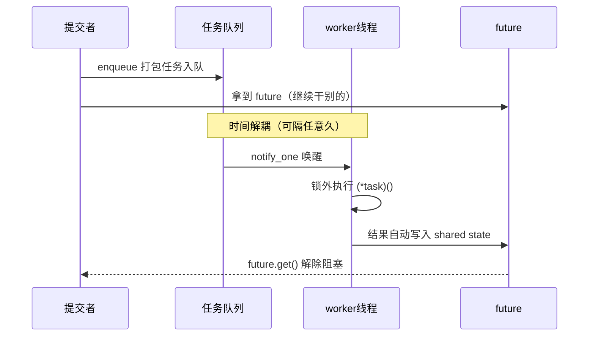

# lambda 闭包原理


## 遇到的问题

在写代码时经常要给 `std::sort` 传比较器。有次我需要按"与某个阈值距离的远近"排序：

```cpp
int x = 10;                       // 阈值

bool cmp(int a, int b){                   
    return std::abs(a - x) < std::abs(b - x);
    // 发现编译错误：cmp 接受不到 x
}
```
x 传不进函数体，这是 C++ 的常识。但换 lambda 写：

```cpp
std::sort(v.begin(), v.end(),
    [x](int a, int b){            // 捕获 x
        return std::abs(a - x) < std::abs(b - x);
    });
```
假设 x、cmp 与 lambda 均处于 main 函数的作用域之内，但 C++ 不允许普通函数嵌套定义于函数体内，所以 cmp 只能声明于文件作用域，其函数体在编译期即与 main 的局部变量隔离。而 lambda 则作为表达式，可在 main 内就地创建，并将 x 捕获为自身成员。这一特性体现了 lambda 的强大，本文将从此思考点出发，逐步剖析该表达式。

---

## 一、lambda 的完整语法格式与编译期本质

lambda 的完整形态（C++17）

```cpp
[capture_list](params) mutable noexcept(expr) -> return_type { body }
```

各组成部分的含义如下：

| 组成 | 含义 | 说明 |
|:--|:--|:--|
| capture_list | 捕获列表 | 声明要捕获哪些外部变量以及捕获方式 |
| params | 参数表 | 与普通函数一致，可以用 auto 泛型参数（泛型 lambda）|
| mutable | 可选关键字 | 解除 operator() 的 const 属性|
| noexcept | 可选异常说明 | 声明是否抛出异常 |
| return_type | 可选返回值类型 | C++11 起支持自动推导 |
| body | 函数体 | lambda 被调用时执行的代码 |

去掉全部可选项，lambda 的最小形态是 `[capture](params){ body }`。

以最简形式为例：

```cpp
auto add = [](int a, int b){ return a + b; };
```

编译器将其展开为一个匿名结构体（不同编译器生成的内部名称不同，这里以 `__lambda_1` 示意）：

```cpp
struct __lambda_1{
    int operator()(int a, int b) const{ return a + b; }
};
auto add = __lambda_1{};
```

由此得到一个关键结论：lambda 不是函数，而是对象。函数体对应其 `operator()`，捕获的变量对应其成员变量；编译器将 lambda 表达式翻译为一个匿名类，并在表达式出现的位置构造该类的对象——add 即为该构造所得的对象实例。

## 二、捕获机制

闭包的标准定义是"函数与环境的组合"。C++ 的实现方式是：把环境（可见的局部变量）在**创建时刻**抓取为闭包对象的成员。三种捕获方式的对比：



### 2.1 值捕获

```cpp
int x = 10;
auto l = [x]{ return x; };
```

展开后：

```cpp
struct __lambda_2{
    int x;                              // 成员变量，构造时从外部 x 拷贝
    int operator()() const{ return x; }
};
```

值捕获在 lambda 对象构造时完成一次拷贝，之后与外部变量再无关联——外界修改 x，闭包内的副本不受影响；闭包内（在 mutable 允许时）修改副本，外部也看不到。

### 2.2 引用捕获

```cpp
int x = 10;
auto l = [&x]{ return x; };
```

展开后成员类型为 `int&`。引用捕获不拷贝数据，闭包内对 x 的访问实时映射到外部变量。代价是**生命周期依赖**：若 x 先于闭包对象销毁，闭包内的引用即悬垂，访问是未定义行为（UB）。

### 2.3 初始化捕获：捕获一个表达式

```cpp
auto l = [y = std::make_unique<int>(42)]{ return *y; };
```

此时成员类型由初始化表达式推导（这里为 `std::unique_ptr<int>`），为移动语义提供了入口。

### 2.4 this 捕获的两种形态

在成员函数内捕获 this，成员类型是**指针**，而不是对象本身：

```cpp
class Widget{
    int value_;
public:
    auto get_lambda(){
        return [this]{ return value_; };   // 捕获 this 指针
    }
};
```

这带来一个经典隐患：若 Widget 对象先于 lambda 销毁，lambda 内的 this 悬垂。C++17 提供 `[*this]` 捕获对象副本：

```cpp
auto get_lambda(){
    return [*this]{ return value_; };      // 捕获对象副本，成员类型为 Widget
};
```

代价是对象拷贝的开销，换来生命周期上的安全。

### 2.5 默认捕获 `[=]` 与 `[&]`

`[=]` 对全部可见自动变量按值捕获，`[&]` 按引用捕获。两者是语法糖，等价于逐一列出捕获项。需要注意的是：**this 指针在任何成员函数中都是"被按值捕获的自动变量"**，因此成员函数内写 `[=]` 实际会隐式捕获 this，这是 `[=]` 悬垂风险的高发场景，代码审查时应格外留意。

## 三、operator() 的 const 语义与 mutable

默认情况下，匿名类的 `operator()` 是 const 成员函数。这意味着值捕获的成员在闭包内是只读的：

```cpp
int x = 10;
auto l = [x]{ x++; };          // 编译错误：不能修改 const 成员
```

这一设计符合闭包的函数式语义：值捕获产生的是环境快照，快照应不可变，lambda 表现为"纯函数"。若确实需要修改副本，加 `mutable`：

```cpp
int x = 10;
auto l = [x]() mutable { x++; };   // 合法：修改的是副本
// 外部 x 仍为 10
```

需要强调的是：mutable 修改的是**闭包内的副本**，与外部变量无关。

## 四、无捕获 lambda 到函数指针的退化

函数指针是一种变量，其值为某段函数代码的入口地址。调用函数指针时，程序跳转至该地址执行；函数所需的参数由调用方在调用点传入，函数指针本身不携带任何与数据相关的信息。

lambda 的 operator() 是成员函数。对于捕获了变量的 lambda，其 operator() 在执行时需要访问闭包对象的成员（如值捕获变量的副本），而成员访问依赖对象地址（this）。函数指针的调用不提供对象地址——调用方仅跳转至代码地址，不携带任何对象信息。因此，捕获了变量的 lambda 无法转换为函数指针：转换后成员无从访问，代码无法正确执行。

无捕获 lambda 的 operator() 不访问任何成员变量，其执行不依赖对象地址，即使不存在闭包对象，代码亦可独立运行。此时 lambda 与普通函数在行为上无差别，标准因此允许其向同签名的函数指针隐式转换：

```cpp
void (*fp)() = []{};    // 合法
int x = 10;
void (*fp2)() = [x]{};  // 非法
```

无捕获 lambda 的匿名类不含成员变量，属于空类，C++ 规定任何对象至少占用一字节的存储，保证不同对象具有不同地址，因此 lambda 对象本身占 1 字节。转换为函数指针后，对象不再存在，调用直接使用代码地址，"无状态"特性由此体现。

## 五、结合std::function

lambda 类型唯一且各不相同，而回调容器、事件系统、任务队列需要"存放任意可调用对象"。`std::function` 通过类型擦除实现这一点：容器只保留签名（如 `int(int,int)`），抹掉具体类型，内部通过指向存储的调用目标间接调用。

```cpp
std::function<int(int,int)> f;
f = [](int a, int b){ return a + b; };
f(3, 4);   // 返回 7
```

类型擦除的代价是显著的，其一，调用从编译期直接调用退化为运行时间接跳转，出现**无法内联**性能损失；其二，`std::function` 对小对象有小型缓冲优化（SBO），缓冲容纳不下的可调用对象需要堆分配，拷贝即产生分配开销；其三，空 `std::function` 被调用时抛出 `std::bad_function_call`，引入运行时分支。

选择原则由此明确：**类型在编译期可知时，用 `auto` 保存 lambda（零开销、可内联）；只有确实需要"多态地存放可调用对象"时才使用 `std::function`**。

## 六、生命周期陷阱

闭包机制的全部风险集中在一点：**闭包对象存活期间，被捕获对象必须同样存活**。常见高发场景：

一，引用捕获悬垂。函数返回 lambda 时，lambda 内引用的局部变量已经销毁：

```cpp
std::function<int()> make(){
    int x = 42;
    return [&x]{ return x; };   // x 已销毁，调用即未定义行为
}
```

二，this 捕获悬垂。对象先于闭包析构（如闭包被异步执行），访问即崩溃或读到垃圾数据。

应对方案是让捕获对象与闭包共享生命周期：在并发场景中，最常用的手段是捕获 `std::shared_ptr`——闭包持有引用计数，捕获对象存活期被闭包延长，直到最后一个闭包销毁。
## 七、并发场景中的应用

lambda 的闭包能力在并发编程中承担了核心角色。以线程池为例，任务被拍扁为"无参无返回值的动作"存储于队列：

```cpp
std::queue<std::function<void()>> tasks;
```

提交端任意签名的调用被 enqueue 收口：

```cpp
template<class F, class... Args>
auto enqueue(F&& f, Args&&... args)
    -> std::future<std::invoke_result_t<F, Args...>>{
    using return_type = std::invoke_result_t<F, Args...>;
    auto task = std::make_shared<std::packaged_task<return_type()>>(
        std::bind(std::forward<F>(f), std::forward<Args>(args)...));
    std::future<return_type> res = task->get_future();
    {
        std::lock_guard<std::mutex> lock(queue_mutex);
        tasks.emplace([task]{ (*task)(); });
    }
    cv.notify_one();
    return res;
}
```

任务从提交到获取结果的完整生命周期：



闭包机制在此有三处典型应用：

1. **参数绑定**：`std::bind` 将函数与实参绑定为无参可调用对象，任务得以统一为 `void()` 形态进入队列，队列仅需依赖单一接口。
2. **捕获共享生命周期**：`packaged_task` 不可拷贝，故以 `std::shared_ptr` 包裹，lambda 捕获 shared_ptr 副本——任务本体仅存一份，lambda 在队列与 worker 之间的拷贝与移动均无风险，且 shared_ptr 保证任务在执行前不会被销毁。
3. **完美转发**：`std::forward<F>(f), std::forward<Args>(args)...` 保持实参的左右值属性，move-only 类型（如 unique_ptr）的实参得以原样进入任务。

值得注意的细节是：lambda 捕获 shared_ptr 属于值捕获，捕获的是指针本身；任务真正的执行期（worker 取出并调用）可能远晚于提交时刻，但 shared_ptr 的生命周期延长机制保证不会引入悬垂。这正是闭包机制在并发程序设计中的价值所在——**把一段代码与其需要的环境打包成可传递、可延迟执行的对象**。

## 总结

lambda 之所以能带走普通函数带不走的局部变量，根源在于它的实现形态：lambda 不是函数，而是编译器生成的匿名类对象，函数体对应 operator()，捕获的变量对应成员变量，创建时刻将外部变量抓为成员，之后随对象携带传递。

回到开头的问题：std::sort 的比较器之所以能捕获阈值 x，正是因为 lambda 在创建时把 x 拷贝成了自己的成员，环境随对象走，调用只传变化的参数。

本人能力有限，文章如有错误或遗漏之处，欢迎指正。

---

## 参考资料

1. cppreference — Lambda expressions
2. cppreference — std::function
3. 《Effective Modern C++》
4. 《深入理解计算机系统》
