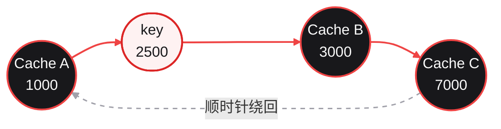

# 一致性哈希详解：从哈希环到分布式缓存

## 问题背景

假设有一个分布式缓存集群，三台缓存服务器保存用户数据：

```text
Cache A
Cache B
Cache C
```

客户端需要根据 key 找到负责它的服务器。例如：

```text
user:1001
user:1002
order:9527
```

最简单的分配方式是取模哈希：

```cpp
std::size_t index=std::hash<std::string>{}(key)%node_count;
```

三台服务器时使用 `hash(key)%3`。如果增加一台服务器，计算方式变成 `hash(key)%4`，大部分 key 的结果都会改变。原来保存在 Cache A、Cache B、Cache C 中的数据需要重新加载，缓存命中率会在扩容后明显下降。

一致性哈希不把哈希值直接转换成节点下标，而是把节点和 key 放到同一个哈希环中。节点数量变化时，只有受影响的一小段 key 需要重新分配。

---

## 一、取模哈希为什么会导致大量迁移

假设有三个节点：

| 下标 | 节点 |
|:--:|:--|
| 0 | Cache A |
| 1 | Cache B |
| 2 | Cache C |

使用：

```cpp
node_index=hash(key)%3;
```

一批 key 的分配结果可能是：

| Key | `hash(key)%3` | 节点 |
|:--|:--:|:--|
| `user:1001` | 0 | A |
| `user:1002` | 1 | B |
| `order:9527` | 2 | C |
| `order:9528` | 0 | A |

现在加入 Cache D：

```cpp
node_index=hash(key)%4;
```

同一批 key 需要重新计算：

| Key | `hash(key)%4` | 新节点 |
|:--|:--:|:--|
| `user:1001` | 2 | C |
| `user:1002` | 0 | A |
| `order:9527` | 1 | B |
| `order:9528` | 3 | D |

节点 A、B、C 并没有全部失效，但 key 的归属仍然发生了大范围变化。

当 key 的哈希结果近似均匀时，从 `N` 个节点增加到 `N+1` 个节点，平均约有：

```text
N/(N+1)
```

的 key 会改变节点。原有节点越多，这个比例越接近 100%。

因此，取模哈希的主要问题不是查询慢，而是节点集合变化后会产生大规模缓存迁移。

---

## 二、把节点和 key 放到同一个哈希环

以 32 位无符号整数为例，哈希值范围是：

```text
0 ~ 2^32-1
```

把最大值和 0 连接起来，就得到了哈希环。

节点加入哈希环时，计算节点标识的哈希值：

```cpp
uint32_t node_hash=hash_func("Cache-A");
```

请求 key 也使用同一个哈希函数：

```cpp
uint32_t key_hash=hash_func("user:1001");
```

节点和 key 原本是不同的字符串，不能直接比较。哈希之后，它们都变成哈希环上的一个整数位置，因而可以进行位置比较。

假设三个节点在环上的位置如下：

```text
位置 1000：Cache A
位置 3000：Cache B
位置 7000：Cache C
```

某个 key 的哈希值为 2500。沿顺时针方向查找，遇到的第一个节点是位置 3000 的 Cache B，因此该 key 由 B 负责。

如果 key 的哈希值为 9000，顺时针方向已经没有更大的节点位置，就绕回环的起点，交给位置 1000 的 Cache A。

下面的图把这个查找过程画在一起。`key=2500` 位于 Cache A 和 Cache B 之间，沿顺时针方向遇到的第一个节点是 Cache B：



一致性哈希的节点选择规则可以概括为：

> key 映射到环上的位置后，顺时针找到的第一个节点就是它的负责节点。

---

## 三、节点变化为什么只影响局部 key

继续使用前面的环：

```text
1000：Cache A
3000：Cache B
7000：Cache C
```

节点 B 负责的区间是 `(1000,3000]`。这个区间内的 key 会顺时针遇到 B，区间外的 key 不由 B 负责。

如果删除 B，`(1000,3000]` 这段区间会交给顺时针方向的下一个节点 C。A 和 C 原有的其他区间不变。

如果在 2000 的位置加入 D，只有 `(1000,2000]` 区间内的 key 会从 A 转移给 D，D 不会影响 B 和 C 负责的区间。

这就是一致性哈希中“局部迁移”的含义：

- 删除一个节点，只需要处理这个节点原来负责的区间；
- 增加一个节点，只需要从某个已有节点的区间中切出一部分；
- 其他区间的 key 不需要改变目标节点。

这里的“局部”描述的是 key 到节点的映射变化，不代表更新哈希环的代码一定只修改一个数组元素。具体实现可以选择增量更新，也可以在节点列表变化后重建整个内存结构。

---

## 四、虚拟节点如何改善负载分布

### 1. 只有真实节点时的问题

如果每个服务器只在环上放置一个位置，节点可能分布得很不均匀：

```text
Cache A                         Cache B       Cache C
|-------------------------------|-------------|
```

A 和 B 之间的区间很大，A 负责的 key 数量会明显多于 C。

### 2. 为一个节点放置多个位置

虚拟节点把一个真实服务器拆成多个环上位置：

```text
Cache-A#0
Cache-A#1
Cache-A#2
Cache-B#0
Cache-B#1
Cache-C#0
```

每个虚拟节点都有独立的哈希值，但最终都映射回同一个真实节点：

| 虚拟节点 | 真实节点 |
|:--|:--|
| `Cache-A#0` | Cache A |
| `Cache-A#1` | Cache A |
| `Cache-A#2` | Cache A |
| `Cache-B#0` | Cache B |
| `Cache-B#1` | Cache B |
| `Cache-C#0` | Cache C |

这些虚拟节点分散在哈希环上，Cache A 负责的总区间是所有 `Cache-A#*` 区间之和。

### 3. 虚拟节点数量不是越多越好

增加虚拟节点通常可以降低负载波动，但也会增加：

- 哈希环占用的内存；
- 节点加入和删除时的更新成本；
- 哈希冲突处理的复杂度；
- 动态调整时的路由变化次数。

实际系统需要根据节点数量、key 分布和更新频率选择副本数，而不是盲目设置一个很大的值。

---

## 五、一个完整的缓存扩容例子

### 1. 初始集群

假设缓存集群有三个节点，每个节点创建 100 个虚拟节点：

```text
Cache A：A#0 ~ A#99
Cache B：B#0 ~ B#99
Cache C：C#0 ~ C#99
```

将 300 个虚拟节点排序后，任意 key 都能通过顺时针查找找到一个负责节点。

例如，经过哈希计算后，缓存键和负责节点的对应关系可能是：

| 缓存键 | 负责节点 |
|:--|:--|
| `user:1001` | Cache A |
| `user:1002` | Cache C |
| `order:9527` | Cache B |

实际实现中保存的是哈希值和节点地址的对应关系，而不是直接保存这张业务表。

### 2. 增加 Cache D

扩容时只为 D 创建新的虚拟节点：

```text
Cache D：D#0 ~ D#99
```

这些虚拟节点插入环后，每个 D 虚拟节点会从其顺时针后继节点的负责区间中切出一段。

原来属于 A、B、C 的 key，只有落在这些新增区间内的部分会转移到 D。其他 key 仍然访问原来的缓存节点，因此大部分缓存不需要重新加载。

### 3. 删除 Cache B

如果 B 故障或主动下线，删除 `B#0 ~ B#99`。B 原来负责的所有区间会交给对应的顺时针后继节点，通常是 A、C 或 D 中的某一个。

客户端只需要让新的查询不再命中 B。对于已经失效的缓存数据，可以在访问新节点时重新从数据库加载。

### 4. 数据副本

一致性哈希只决定一个 key 的主节点，并不自动提供数据副本。

如果希望 Cache B 故障后仍能快速读取，可以让 key 同时保存到主节点和后继节点：

```text
主节点：Cache B
副本节点：Cache C
```

此时需要额外定义副本写入、读取降级和数据一致性策略。哈希环负责节点定位，副本机制负责数据冗余，二者不能混为一谈。

---

## 六、哈希环的典型实现

一种简单实现使用有序哈希数组和映射表：

```cpp
class ConsistentHash{
public:
	void add_node(const std::string& node,int replicas){
		for(int index=0;index<replicas;index++){
			std::string virtual_node=node+"#"+std::to_string(index);
			uint32_t hash_value=hash_func(virtual_node);
			hash_keys_.push_back(hash_value);
			hash_to_node_[hash_value]=node;
		}

		std::sort(hash_keys_.begin(),hash_keys_.end());
	}

	std::string get_node(const std::string& key)const{
		if(hash_keys_.empty()){
			return {};
		}

		uint32_t hash_value=hash_func(key);
		auto iterator=std::lower_bound(hash_keys_.begin(),hash_keys_.end(),hash_value);

		if(iterator==hash_keys_.end()){
			iterator=hash_keys_.begin();
		}

		return hash_to_node_.at(*iterator);
	}

private:
	uint32_t hash_func(const std::string& value)const;

	std::vector<uint32_t> hash_keys_;
	std::unordered_map<uint32_t,std::string>hash_to_node_;
};
```

查询过程分为四步：

1. 计算 key 的哈希值；
2. 在有序数组中查找第一个不小于该值的位置；
3. 如果到达数组末尾，就回到数组开头；
4. 根据虚拟节点哈希值取得真实节点。

设环上共有 `V` 个虚拟节点，查询复杂度为 `O(log V)`。节点更新后重新排序的复杂度通常为 `O(V log V)`。

### 哈希冲突的处理

上面的示例使用 `hash_value` 作为唯一 key。如果两个虚拟节点产生相同哈希值，后写入的节点会覆盖前一个节点。

更稳妥的实现可以保存：

```cpp
std::vector<std::pair<uint32_t,std::string>> ring_points;
```

排序时先比较哈希值，再比较节点标识；查询时使用二分查找定位哈希区间。也可以使用更大的哈希空间降低冲突概率，但不能把“概率很低”当作“绝对不会发生”。

---

## 七、适用条件与实现边界

一致性哈希首先要求路由 key 稳定。以缓存为例，`user:1001` 每次都应该使用同一个 key，这样它才能在节点集合不变时持续命中同一个节点。如果 key 每次都随机生成，哈希环只能把请求分散开，无法提供稳定的缓存定位。

哈希环保存的是节点列表，不是节点健康状态。节点已经宕机但仍留在环上时，查询仍可能返回这个节点。因此，节点摘除必须依赖健康检查、注册中心事件或连接失败反馈；超时、重试和熔断也不属于一致性哈希本身。

虚拟节点数量还需要和节点能力匹配。服务器容量相同，可以为每个节点配置相近的副本数；如果节点的内存、CPU 或网络能力不同，就应该使用不同的权重。权重越高的节点放置更多虚拟节点，但这会同时增加环的大小和更新成本。

节点列表频繁变化时，局部迁移仍可能变成持续抖动。尤其是动态调整虚拟节点数量，每次调整都会改变部分 key 的归属。实际实现需要限制调整频率和单次调整幅度，并保留足够长的统计窗口，避免根据短时流量波动反复改环。

一致性哈希并不是所有负载均衡场景的默认选择。完全无状态的服务如果只关心连接数或当前响应压力，轮询、随机或最少连接通常更直接；需要根据稳定 key 定位缓存、分片数据或会话状态时，一致性哈希才更有优势。

---

## 总结

1. **取模哈希**直接依赖节点数量，扩容或缩容时会导致大量 key 重新映射。
2. **一致性哈希**把节点和 key 映射到同一个哈希环，按照顺时针方向找到目标节点，节点变化时主要影响相邻区间。
3. **虚拟节点**把一个真实节点分散到环上的多个位置，用于减小节点分布不均造成的负载偏差。
4. **分布式缓存场景**中，稳定的缓存 key 可以让同一份数据长期访问同一个节点，扩容时只迁移部分缓存。
5. **一致性哈希只负责节点定位**，数据副本、健康检查、故障转移和重试都需要额外设计。
6. **实现时需要处理**哈希冲突、节点权重、更新抖动和查询结构并发访问等工程问题。

本人能力有限，文章如有错误或遗漏之处，欢迎指正。

---

## 参考资料

1. 《Designing Data-Intensive Applications》
2. 《大型网站技术架构：核心原理与案例分析》
