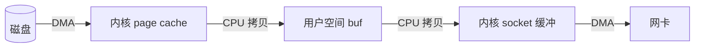
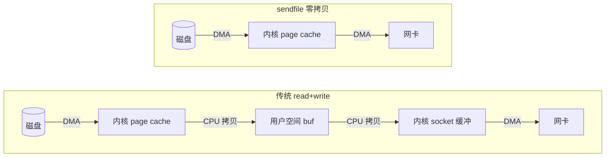

# 零拷贝到底快在哪？

> **实验环境**：Ubuntu 24.04 x86_64（VMware 虚拟机），gcc 13.2，glibc 2.39，200MB 随机文件
> **注意**：虚拟机的硬盘和网卡是 VMware 虚拟出来的，数据比物理机多绕了一层，所以 sendfile 的优势在物理机上会缩小一些。但系统调用十万次变一次、CPU 拷贝 2 次变 0 次——这些结论不依赖硬件，物理机上也一样成立。

---

## 一、先说结论

```
传统 read+write：   294 ms（外加 102,403 次系统调用）
sendfile 零拷贝：    126 ms（外加 1 次系统调用）
```
关键指标对比如下：

- **耗时**：sendfile（126ms）为传统方案（294ms）的 43%，差距 2.3 倍
- **系统调用**：传统方案调用十万多次，sendfile 仅 1 次
- **CPU 拷贝**：传统方案 2 次，sendfile 0 次
- **用户空间交互**：传统方案全程参与，sendfile 数据不经过用户态

---

## 二、传统 read+write

传统方案：

```c
char buf[4096];
while((n = read(src_fd, buf, sizeof(buf))) > 0)
    write(dst_fd, buf, n);
```

两行代码，背后数据走了四趟：

```
磁盘 -DMA- 内核缓冲 -CPU- 用户缓冲 -CPU- 内核socket缓冲 -DMA- 网卡
```



| 步骤 | 硬件 | 工作原理 | CPU参与？ |
|:----:|:------:|:---------|:--------:|
| ① | DMA控制器 | 磁盘→内核 page cache |  不参与 |
| ② | **CPU** | 内核 page cache→用户空间buf |  **参与** |
| ③ | **CPU** | 用户空间buf→内核socket缓冲 |  **参与** |
| ④ | DMA控制器 | 内核socket缓冲→网卡 |  不参与 |

从第二步和第三步可以看出，数据不需要修改却被迫经过用户空间，产生了两次不必要的 CPU 拷贝。

再看系统调用次数。200MB ÷ 4096B = 51200 个数据块，每个数据块对应一次 read() 和一次 write() 调用，最后一次 read() 返回 0 指示 EOF。合计系统调用次数超过 **十万次**。每次系统调用涉及用户态到内核态的上下文切换——寄存器保存与恢复、栈切换、系统调用表查找——这些开销累加后，往往超过数据拷贝本身的时间开销。

---

## 三、sendfile 零拷贝

```c
#include <sys/sendfile.h>

off_t offset = 0;
sendfile(dst_fd, src_fd, &offset, file_size);
```

sendfile 让数据全程待在内核里：

```
磁盘 -DMA- 内核 page cache  -DMA- 网卡 
```


**两次拷贝均由 DMA 控制器完成，CPU 全程不参与数据搬运。** sendfile 仅需向 DMA 传递描述信息——数据在 page cache 中的位置偏移与传输长度。这些元数据仅数十字节，传输 200GB 与 200MB 在该层面的开销并无差异。

> sendfile 返回值可能小于你要的 `count`，不能只调一次，需配合循环使用：
> ```c
> while(offset < file_size){
>     sent = sendfile(dst_fd, src_fd, &offset, file_size - offset);
>     if(sent == -1){ perror("sendfile"); exit(1); }
> }
> ```
> 注意 `offset` 参数为指针类型，sendfile 会在每次调用后自动更新其值，无需手动推进。若忽略循环处理，大文件传输将出现数据截断。

---

## 四、实验

### 4.1 测试代码

两个程序实现相同的功能——读取源文件，写入目标文件。区别在于数据传输路径是否经过用户空间。

**traditional.c**（部分核心代码）：
```c
while((n = read(src_fd, buf, sizeof(buf))) > 0)
    write(dst_fd, buf, n);
```

**sendfile.c**：
```c
off_t offset = 0;
while(offset < file_size)
    sendfile(dst_fd, src_fd, &offset, file_size - offset);
```

两个程序均采用 `clock_gettime(CLOCK_MONOTONIC)` 计时，输出毫秒级耗时。

### 4.2 运行结果

生成 200MB 测试文件：

```bash
rr@rr-VMware-Virtual-Platform:~/os_lab/zero_copy$ dd if=/dev/urandom of=test.bin bs=1M count=200
200+0 records in
200+0 records out
209715200 bytes (210 MB, 200 MiB) transferred, 1.70802 s
```

编译：

```bash
rr@rr-VMware-Virtual-Platform:~/os_lab/zero_copy$ gcc -O2 -Wall traditional.c -o traditional
rr@rr-VMware-Virtual-Platform:~/os_lab/zero_copy$ gcc -O2 -Wall sendfile.c -o sendfile
```
执行: 

```bash
rr@rr-VMware-Virtual-Platform:~/os_lab/zero_copy$ ./traditional test.bin /tmp/traditional_out.bin
traditional: 294 ms

rr@rr-VMware-Virtual-Platform:~/os_lab/zero_copy$ ./sendfile test.bin /tmp/sendfile_out.bin
sendfile: 126 ms
```

**126ms vs 294ms，sendfile 耗时约为传统方案的 43%，差距 2.3 倍。** 本实验在虚拟机中运行，VMware 的软件模拟层为两种方案都增加了额外开销——但传统方案中 CPU 拷贝和十万次系统调用的开销受虚拟机影响更显著，使得差距被放大。在物理机上耗时倍率预计小一点。不过，**系统调用次数从十万次降至一次、CPU 拷贝次数从两次降为零——这些结构性优势是硬件无关的。**

两种数据传输路径的对比如下：



### 4.3 strace 系统调用统计

耗时数据之外，strace 可提供系统调用次数的精确统计：

```bash
rr@rr-VMware-Virtual-Platform:~/os_lab/zero_copy$ strace -e trace=read,write -c ./traditional test.bin /tmp/traditional_out.bin
traditional: 12671 ms    
% time     seconds  usecs/call     calls    errors syscall
 60.74    1.528800          29     51201           write
 39.26    0.988125          19     51202           read
100.00    2.516925          24    102403           total
```

**传统方案：read 51202 次 + write 51201 次 = 102403 次系统调用。**

```bash
rr@rr-VMware-Virtual-Platform:~/os_lab/zero_copy$ strace -e trace=sendfile -c ./sendfile test.bin /tmp/sendfile_out.bin
sendfile: 65 ms
% time     seconds  usecs/call     calls    errors syscall
100.00    0.064770       64769         1           sendfile
100.00    0.064770       64769         1           total
```

**sendfile：仅 1 次系统调用。**

> **注**：strace 下传统方案耗时从 294ms 升至 12671ms，是因为 strace 在每次系统调用前后插入 ptrace 拦截，十万次调用累积了大量额外上下文切换开销。strace 环境的绝对耗时不可作为性能依据，但系统调用次数统计是准确的。

---

## 五、mmap+write 与 splice

### 5.1 mmap+write：减少一次 CPU 拷贝

mmap 将文件映射至进程地址空间，用户空间的读写直接操作内核 page cache，省去了"内核-用户"的数据拷贝。但 write 时仍需从映射页拷贝至 socket 缓冲区，因此仍保留一次 CPU 拷贝。

三种方案对比如下：

- **read+write**：CPU 拷贝 2 次，系统调用十万级
- **mmap+write**：CPU 拷贝 1 次，系统调用万级
- **sendfile**：CPU 拷贝 0 次，系统调用 1 次

### 5.2 splice：更通用的零拷贝接口

sendfile 仅支持文件-socket 的传输。若需要在管道与 socket 之间、或两个 socket 之间实现零拷贝，可以使用 splice。

```c
splice(file_fd, NULL, pipe_fd[1], NULL, 4096, 0);   // 文件-管道
splice(pipe_fd[0], NULL, socket_fd, NULL, 4096, 0); // 管道-socket
```

splice 的使用限制：至少一端必须是管道。Nginx 即采用 splice 构建文件到网络的零拷贝流水线。不过 splice 的编程复杂度高于 sendfile，如果只需要文件-socket 传输，sendfile 仍是更简洁的选择。

---

## 六、零拷贝的适用边界

零拷贝虽能显著降低数据传输开销，但并非所有场景均适用。以下情况不建议采用 sendfile：

1. **需要修改数据**：若传输前需对数据加工（如添加 HTTP 头部、压缩或加密），sendfile 绕过用户空间的特性使其无法对数据进行操作。此时可考虑 mmap+write，保留一次 CPU 拷贝给数据修改。
2. **传输数据量较小**：当数据量仅为数十字节时，系统调用开销不显著，代码的可读性和可维护性较性能优化更为重要。
3. **随机读取场景**：sendfile 按文件偏移顺序传输，不适用于跳跃式或非连续的数据读取模式。

---

## 总结

零拷贝的核心思路在于：数据无需经用户空间处理时，应避免不必要的用户态介入。传统 read+write 路径产生了两次 CPU 拷贝与十万余次系统调用，这些开销中相当部分源自数据在用户空间与内核空间之间的往复传输。sendfile 将数据搬运交由 DMA 控制器完成，CPU 仅传递地址偏移与传输长度等描述信息，元数据开销仅数十字节。

但零拷贝并非适用于所有场景。数据需要修改时 sendfile 无法胜任，数据量极小时系统调用开销不构成瓶颈，代码可读性更为优先。在实际工程中，sendfile 适用于静态文件分发等场景，mmap+write 则适合需要零拷贝但同时也需修改数据的中间情形。

本文测试代码可在 [os_lab/zero_copy](https://github.com/Rrrayy/os_lab/tree/main/zero_copy) 获取。

本人能力有限，文章如有错误或遗漏之处，欢迎指正。

## 参考资料

1. Linux `man 2 sendfile`
2. Linux `man 2 splice`
3. 小林 coding → OS → 零拷贝篇
4. [os_lab/zero_copy](https://github.com/Rrrayy/os_lab) — 本文实验代码
