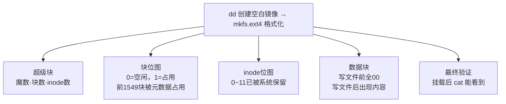

# ext4文件系统详解：用dd和mkfs.ext4从零解剖


---

## 一、前言

学习完本文后，可以解决以下问题：

1. `ls -l` 看到的信息存在磁盘的什么位置？
2. 格式化时往磁盘上写了什么内容？
3. inode、位图在磁盘上的原始长相是怎样的？


---

## 二、准备实验环境

### 第一步：创建磁盘镜像

>  `dd` 命令是 Linux 的复制工具——按块复制数据，不考虑文件格式。
> - `if=/dev/zero`：输入文件，`/dev/zero` 是一个全零设备，读它就会不断输出 0x00
> - `of=ext4_demo.img`：输出文件，就是我们的磁盘镜像
> - `bs=1M`：每次读写 1MB（block size）
> - `count=32`：读 32 次 → 32×1MB = 32MB 总大小
>
> 这行命令的意思就是："从零设备读 32 个 1MB 的块，写到一个文件里"，结果是一个全零的 32MB 文件。

```bash
rr@rr-VMware-Virtual-Platform:~/桌面$ dd if=/dev/zero of=ext4_demo.img bs=1M count=32
输入了 32+0 块记录
输出了 32+0 块记录
33554432 字节 (34 MB, 32 MiB) 已复制，0.117051 s，287 MB/s
```

从 `/dev/zero` 读出 32MB 的全零数据，写入一个镜像文件。现在假定文件就是一块空白磁盘。

### 第二步：格式化为 ext4

>  `mkfs.ext4` = **M**aKe **F**ile**S**ystem **ext4**。在指定设备上创建一个空的 ext4 文件系统。
> - 它会自动检测设备大小，选择合适的块大小和 inode 数量
> - 写入超级块、组描述符、位图、inode 表、日志等元数据
> - 本文核心就是格式化后用 `hexdump` 把这些元数据读出来进行分析。

```bash
rr@rr-VMware-Virtual-Platform:~/桌面$ mkfs.ext4 ext4_demo.img
mke2fs 1.47.0 (5-Feb-2023)
丢弃设备块： 完成                            
创建含有 8192 个块（每块 4k）和 8192 个 inode 的文件系统
正在分配组表： 完成                            
正在写入 inode表： 完成                            
创建日志（1024 个块）： 完成
写入超级块和文件系统账户统计信息： 已完成
```

32MB 格式化后自动选择了块大小 **4096 字节**（4K），共有 **8192 个块**、**8192 个 inode**。注意它自动创建了 **1024 个块**的日志。


---

## 三、整体布局

ext4 把磁盘分成若干个**组**，每块组内部有一套完整的元数据副本。ext4 默认每 **128MB** 划分一个组，我们这个镜像只有 32MB，所以只创建了**组 0** 这一个组，内部按固定顺序排列：


每块区域的作用：

| 区域 | 存放内容|
|:----|:---------|
| **超级块** | 文件系统元数据入口——记录 inode/block 总量、块大小、魔数、时间戳等全局信息 |
| **组描述符(GDT)** | 每组的结构描述表——保存块位图、inode 位图、inode 表各自的起始块号 |
| **块位图** | 以 bit 为单位标记数据块的分配状态，1=已分配，0=空闲，每 bit 对应一个 block |
| **inode 位图** | 以 bit 为单位标记 inode 的分配状态，1=已占用，0=空闲 |
| **inode 表** | inode 结构体的连续存储区域，每个 inode 固定 256 字节 |
| **日志** | 预写日志（WAL）区域，通过记录元数据变更实现崩溃一致性 |
| **数据块区** | 文件数据和目录项的实际物理存储空间 |

>  `dumpe2fs` = **Dump** **Ext2** **F**ile**S**ystem（该命令支持 ext2/3/4 文件系统）。打印 ext 系列文件系统的超级块和块组信息，不用自己算二进制偏移就能看到元数据。

用 `dumpe2fs` 看组信息：

```bash
rr@rr-VMware-Virtual-Platform:~/桌面$ dumpe2fs ext4_demo.img
...
组 0：(块 0-8191) 校验和 0xb725 [ITABLE_ZEROED]
  主 超级块位于 0，组描述符位于 1-1
  保留的 GDT 块位于 2-4
  块位图位于 5 (+5)，校验和 0x85336636
  inode 位图位于 21 (+21)，校验和 0x1c53302d
  inode 表位于 37-548 (+37)
  6643 个可用块，8181 个可用 inode，2 个目录 ，8181 个未使用的 inode
  可用块数： 1549-8191
  可用 inode 数： 12-8192
```

这说明组 0 的布局是：
- **块 0**：超级块
- **块 1**：组描述符
- **块 2-4**：保留 GDT
- **块 5**：块位图
- **块 21**：inode 位图（注意 6-20 未使用，为了对齐）
- **块 37-548**：inode 表（512 个块，存 8192 个 inode，每个 inode 256 字节）
- **块 549-1548**：日志（mkfs.ext4 输出 1024 块，但 549~1548 只覆盖 1000 块，差额可能分散在日志元数据块中）
- **块 1549-8191**：数据块区

---

## 四、超级块（Superblock）

超级块固定在磁盘的 **1024 字节偏移**处，即块 0 的 1024~2047 字节。

```bash
# 同一命令输出的上半部分——超级块信息
rr@rr-VMware-Virtual-Platform:~/桌面$ dumpe2fs ext4_demo.img
Filesystem volume name:   <none>
Filesystem UUID:          640a028c-696e-48df-86a6-427c4a504fda
Filesystem magic number:  0xEF53
Filesystem revision #:    1 (dynamic)
Inode count:              8192
Block count:              8192
Reserved block count:     409
Block size:               4096
Inode size:               256
First inode:              11
...
```

关键字段：

| 字段 | 值 | 含义 |
|:----|:---|:-----|
| Inode count | 8192 | 最多 8192 个文件 |
| Block count | 8192 | 总块数 |
| Block size | 4096 | 每块 4K |
| Inode size | 256 | 每个 inode 256 字节 |
| First inode | 11 | 第一个可用 inode 编号是 11（0-10 保留） |
| Magic number | 0xEF53 | ext4 魔数，系统启动时校验 |

**看原始字节：**

超级块从偏移 1024（0x400）开始。

 ###  hexdump 输出解析
> 
> `hexdump -C` 的输出分三列：
> ```
> 偏移量          十六进制内容（每行16字节，分成两半）            ASCII翻译
> 00000000  00 00 00 00 00 00 00 00  00 00 00 00 00 00 00 00  |................|
>            ↑ 第1-8字节  ↑ 第9-16字节                              ↑ 16个点 = 全是不可见字符
> 
> 00000430  8f 9e 54 6a 00 00 ff ff  53 ef 01 00 01 00 00 00  |..Tj....S.......|
>                                      ↑↑
>                                   53 ef = 魔数 0xEF53
> ```
> - **第一列** `00000000` / `00000430`：当前行在文件中的偏移量（字节数），十六进制
> - **中间两段** `8f 9e 54 6a ...`：每段 8 字节，两段共 16 字节，就是这行代表的原始数据
> - **最后一列** `|......|`：右边是对应的 ASCII 字符，`.` 表示不可见（0x00~0x1F 的控制字符或高位字节）

 ###  小端序：将 `53 ef` 读成 `0xEF53`
> 
> Intel x86 CPU 存多字节数字时，**低位字节存低地址，高位字节存高地址**。
> 
> 看 `0x438` 处这两个字节：`53 ef`。正常从左往右读是 `0x53EF`——但 CPU 具有独特逻辑：
> - 地址 0x438 存 `53`（低位字节）
> - 地址 0x439 存 `ef`（高位字节）
> - CPU 从 0x438 开始读 2 字节，小端解析为：`0xef` 在高位 + `0x53` 在低位 = **`0xEF53`**
>
> 这叫**小端序（little-endian）**。Windows 和 Linux 普及的 x86 都是小端序，后面看到反直觉的值（比如 `00 20 00 00` = 0x2000 而不是 0x00200000）都是这个原因。

>  `hexdump -C`：把文件的原始字节以十六进制+ASCII 双列显示，是探索磁盘结构最直接的工具。
> - `-C`：同时显示十六进制和对应的 ASCII 字符
> - `-n 2048`：只读前 2048 字节
> - `-s 偏移量`：跳过指定字节数，从中间开始读

```bash
rr@rr-VMware-Virtual-Platform:~/桌面$ hexdump -C -n 2048 ext4_demo.img
00000000  00 00 00 00 00 00 00 00  00 00 00 00 00 00 00 00  |................|
*
00000400  00 20 00 00 00 20 00 00  99 01 00 00 f3 19 00 00  |. ... ..........|
00000410  f5 1f 00 00 00 00 00 00  02 00 00 00 02 00 00 00  |................|
00000420  00 80 00 00 00 80 00 00  00 20 00 00 00 00 00 00  |......... ......|
00000430  8f 9e 54 6a 00 00 ff ff  53 ef 01 00 01 00 00 00  |..Tj....S.......|
00000440  8f 9e 54 6a 00 00 00 00  00 00 00 00 01 00 00 00  |..Tj............|
00000450  00 00 00 00 0b 00 00 00  00 01 00 00 3c 00 00 00  |............<...|
00000460  c2 02 00 00 6b 04 00 00  64 0a 02 8c 69 6e 48 df  |....k...d...inH.|
00000470  86 a6 42 7c 4a 50 4f da  00 00 00 00 00 00 00 00  |..B|JPO.........|
00000480  00 00 00 00 00 00 00 00  00 00 00 00 00 00 00 00  |................|
*
000004c0  00 00 00 00 00 00 00 00  00 00 00 00 00 00 03 00  |................|
000004d0  00 00 00 00 00 00 00 00  00 00 00 00 00 00 00 00  |................|
000004e0  08 00 00 00 00 00 00 00  00 00 00 00 3f 2c 6b af  |............?,k.|
000004f0  ce eb 4a 8a 8a e4 76 10  90 cb 3c 5a 01 01 40 00  |..J...v...<Z..@.|
00000500  0c 00 00 00 00 00 00 00  8f 9e 54 6a 0a f3 03 00  |..........Tj....|
00000510  04 00 00 00 00 00 00 00  00 00 00 00 0a 00 00 00  |................|
00000520  0b 00 00 00 0a 00 00 00  0f 00 00 00 16 00 00 00  |................|
00000530  19 00 00 00 e7 03 00 00  26 02 00 00 00 00 00 00  |........&.......|
00000540  00 00 00 00 00 00 00 00  00 00 00 00 00 00 40 00  |..............@.|
00000550  00 00 00 00 00 00 00 00  00 00 00 00 20 00 20 00  |............ . .|
00000560  01 00 00 00 00 00 00 00  00 00 00 00 00 00 00 00  |................|
00000570  00 00 00 00 04 01 00 00  19 00 00 00 00 00 00 00  |................|
00000580  00 00 00 00 00 00 00 00  00 00 00 00 00 00 00 00  |................|
*
00000640  00 00 00 00 00 00 00 00  07 06 00 00 00 00 00 00  |................|
00000650  00 00 00 00 00 00 00 00  00 00 00 00 00 00 00 00  |................|
*
000007f0  00 00 00 00 00 00 00 00  00 00 00 00 20 a8 5d 9d  |............ .].|
00000800
```

从 `0x400` 开始解读关键字段（注意小端序）：

| 偏移 | 字节 | 小端值 | 含义 |
|:----:|:----:|:------:|:-----|
| 0x400 | 00 20 00 00 | 0x00002000 = **8192** | inode 总数 |
| 0x404 | 00 20 00 00 | 0x00002000 = **8192** | 块总数 |
| 0x418 | 02 00 00 00 | 2（log2值） | 块大小 = 2^(2+10) = **4096** |
| 0x428 | 00 80 00 00 | 0x00008000 = **32768** | 每组块数 |
| 0x438 | 53 ef | **0xEF53** | **魔数！** ext4 身份标识 |

> 魔数 0xEF53 在文件中以小端序存储为 `53 ef`——前面文章提到的 inode 硬链接实验中也见过这个值。系统挂载时先读这个数，对不上就拒绝挂载。

---

## 五、位图（Bitmap）

位图用 1 个 bit 标记一个块/inode 的状态：**1=已占用，0=空闲**。

### 5.1 块位图
根据前文执行的dumpe2fs指令可知：

块位图在 **块 5**（偏移 5×4096 = 0x5000）：

```bash
rr@rr-VMware-Virtual-Platform:~/桌面$ hexdump -C -s $((4096*5)) -n 4096 ext4_demo.img
00005000  ff ff ff ff ff ff ff ff  ff ff ff ff ff ff ff ff  |................|
*
000050c0  ff 3f 00 00 00 00 00 00  00 00 00 00 00 00 00 00  |.?..............|
000050d0  00 00 00 00 00 00 00 00  00 00 00 00 00 00 00 00  |................|
*
00005400  ff ff ff ff ff ff ff ff  ff ff ff ff ff ff ff ff  |................|
*
00006000
```

解读：
- **0x0000-0x00bf**（192 字节）：全 `ff`，表示 **块 0~1535** 全部已占用（超级块、GDT、位图、inode 表、日志）
- **0x00c0**：`ff 3f 00 00`，`3f` = `0011 1111`，表示 **块 1536~1549** 已占用（数据块区最开始的部分：根目录目录项、lost+found 的数据块）
- **0x00c4+**：全 00，**块 1550~8191** 空闲

以 `0x00c0` 处的 `ff 3f` 为例，转为表格更直观：

| 字节索引（相对块5） | 十六进制 | 二进制低位→高位 | 对应块号 | 状态 |
|:-----------------:|:--------:|:--------------:|:--------:|:----:|
| 0x00c0 | ff | 1111 1111 | 1536~1543 | 已分配 |
| 0x00c1 | 3f | 0011 1111 | 1544~1549 | 已分配 |
| 0x00c2+ | 00 | 0000 0000 | 1550+ | 空闲 |

> 位图只占 8192 bit = 1024 字节，即块 5 的前 `0x5000`~`0x53ff`。但 hexdump 显示 `0x5400` 处还有 `ff`——这不是位图数据。块 5 共 4096 字节，位图只用前 1024 字节，剩下的 3072 字节是**块内的剩余空间**（mkfs.ext4 格式化为全 ff），ext4 不会把它们当作位图来解析。

### 5.2 inode 位图

inode 位图在 **块 21**（偏移 21×4096 = 0x15000）：

```bash
rr@rr-VMware-Virtual-Platform:~/桌面$ hexdump -C -s $((4096*21)) -n 256 ext4_demo.img
00015000  ff 0f 00 00 00 00 00 00  00 00 00 00 00 00 00 00  |................|
00015010  00 00 00 00 00 00 00 00  00 00 00 00 00 00 00 00  |................|
*
00015100
```

`ff 0f` = `0000 1111 1111 1111`（小端序），bit 0~11 已置 1，表示 **inode 0~11 已被占用**：
- inode 0：保留
- inode 1：坏块映射
- inode 2：根目录
- inode 8：日志（journal）
- inode 11：lost+found

其余 inode（12~8191）全部空闲。

---

## 六、写入文件后的变化

>  `mount -o loop ext4_demo.img ~/mnt_demo`：把镜像文件当作硬盘设备挂载到目录。
> - `mount`：挂载命令，把一个文件系统接到目录树上
> - `-o loop`：**loop** 模式，将普通文件映射为虚拟块设备（背后内核创建 `/dev/loop0`），这样就能像挂载硬盘一样挂载一个文件
> - `ext4_demo.img`：要挂载的镜像文件（虚拟硬盘）
> - `~/mnt_demo`：挂载点，之后访问这个目录就等于访问镜像里的文件系统

### 6.1 挂载并写入文件

```bash
rr@rr-VMware-Virtual-Platform:~/桌面$ sudo mount -o loop ext4_demo.img ~/mnt_demo
rr@rr-VMware-Virtual-Platform:~/桌面$ sudo sh -c 'echo "Hello, filesystem!" > /home/rr/mnt_demo/test.txt'
rr@rr-VMware-Virtual-Platform:~/桌面$ sudo ls -la /home/rr/mnt_demo/
总计 28
drwxr-xr-x  3 root root  4096  7月 13 16:17 .
drwxr-x--- 27 rr   rr    4096  7月 13 16:15 ..
drwx------  2 root root 16384  7月 13 16:15 lost+found
-rw-r--r--  1 root root    19  7月 13 16:17 test.txt

rr@rr-VMware-Virtual-Platform:~/桌面$ sudo umount /home/rr/mnt_demo  # umount只断开挂载，镜像文件ext4_demo.img还在桌面上，之后用hexdump分析它
```

test.txt 已被创建，19 字节（"Hello, filesystem!\n"）。

### 6.2 重新查看块位图

```bash
rr@rr-VMware-Virtual-Platform:~/桌面$ dumpe2fs ext4_demo.img 2>/dev/null | grep -A2 "组 0"
组 0：(块 0-8191) 校验和 0x91d8 [ITABLE_ZEROED]
  6642 个可用块，8180 个可用 inode，2 个目录 ，8180 个未使用的 inode
  可用块数： 1550-8191
```

对比之前：**可用块从 6643 减少到 6642**，**可用 inode 从 8181 减少到 8180**——test.txt 占用了 1 个块和 1 个 inode。

### 6.3 定位数据块

>  `xxd` 和 `hexdump` 类似，也是看文件十六进制的工具。`xxd` 的输出格式略有不同（偏移在行首，后跟十六进制列），但配合 `grep` 搜索特定字节序列很方便。

根据ASCII表得知 `4865 6c6c 6f` 就是 "Hello" 的 ASCII 十六进制（H=0x48, e=0x65, l=0x6c, l=0x6c, o=0x6f）：

```bash
rr@rr-VMware-Virtual-Platform:~/桌面$ xxd ext4_demo.img | grep "4865 6c6c 6f"
0060d000: 4865 6c6c 6f2c 2066 696c 6573 7973 7465  Hello, filesyste
```

"Hello, filesyste" 在偏移 **0x60d000**，即块号 `0x60d000 ÷ 4096 = **1549**`。

这正是之前块位图中最后一个被占用的块——第 1549 号数据块。

### 6.4 看数据块内容

```bash
rr@rr-VMware-Virtual-Platform:~/桌面$ hexdump -C -s 0x60d000 -n 64 ext4_demo.img
0060d000  48 65 6c 6c 6f 2c 20 66  69 6c 65 73 79 73 74 65  |Hello, filesyste|
0060d010  6d 21 0a 00 00 00 00 00  00 00 00 00 00 00 00 00  |m!..............|
0060d020  00 00 00 00 00 00 00 00  00 00 00 00 00 00 00 00  |................|
*
0060d040
```

- `48 65 6c 6c 6f 2c 20 66 69 6c 65 73 79 73 74 65 6d 21 0a` = ASCII 文本 "Hello, filesystem!\n"
- 之后全 00 填充到块末尾

**这就是一个文件在磁盘上的最终形态**——数据清晰地存放在某个块里，`hexdump` 直接能看到。

---

## 七、验证全链路

重新挂载验证文件是否可读。`mount` 时会先读超级块校验魔数 `0xEF53`，确认这是一个 ext4 文件系统后才挂载：

```bash
rr@rr-VMware-Virtual-Platform:~/桌面$ sudo mount -o loop ext4_demo.img ~/mnt_demo
rr@rr-VMware-Virtual-Platform:~/桌面$ sudo cat /home/rr/mnt_demo/test.txt
Hello, filesystem!
rr@rr-VMware-Virtual-Platform:~/桌面$ sudo umount /home/rr/mnt_demo 
```

文件系统完整可读，说明我们上面拆解的每一层结构都是正确的：超级块的魔数匹配 → 位图标记正确 → inode 表指向的块位置正确 → 数据块里确实存着 `Hello`。这一整套流程能走通，证明从格式化到写入的每一步分析都经得起验证。

---

## 八、总结

本文主要干了两件事：**写文件前读一次  写文件后再读一次  前后对比。**



ext4 其实并没有特别复杂，"文件系统"就是在磁盘上按固定格式摆放的几块区域：**超级块、位图、inode 表、数据块**。位图的哪些 bit 置 1 了、数据块里存放了哪些字符，用 `hexdump` 命令可以直接清晰地查到。

本文的这套 `dd + hexdump ` 的实验流程不只适用于 ext4，换一个文件系统（FAT、NTFS、XFS、Btrfs），元数据布局不同，但分析思路是一样的。

本文是作者关于操作系统中文件系统的第二篇文章，以下是文件系统系列至今的知识点进度：

**第 1 篇已覆盖**（[inode、硬链接与软链接探究](https://blog.csdn.net/rr666888/article/details/162816776)）：inode 概念、硬软链接原理、删除本质、cp/mv/rm 系统调用

**本篇已覆盖**：磁盘布局、小端序 hexdump 解析、写入后位图和数据块变化

文件系统剩余的知识点，接下来会陆续产出。对于计算机学习中操作系统这一板块，限于篇幅也限于本人能力，某些细节无法一一展开，如有补充或建议，欢迎在评论区留言！

