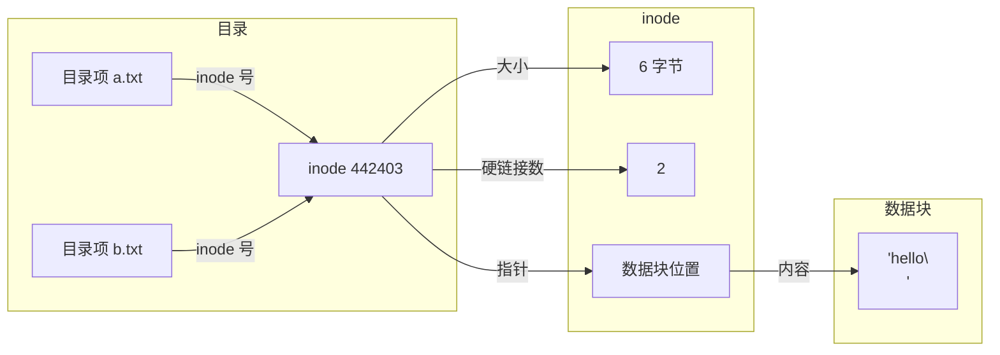
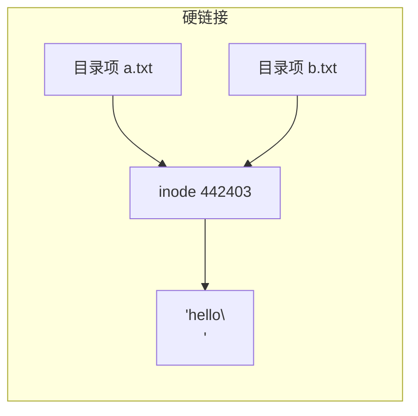
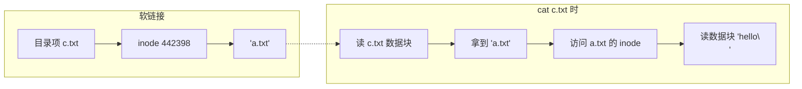
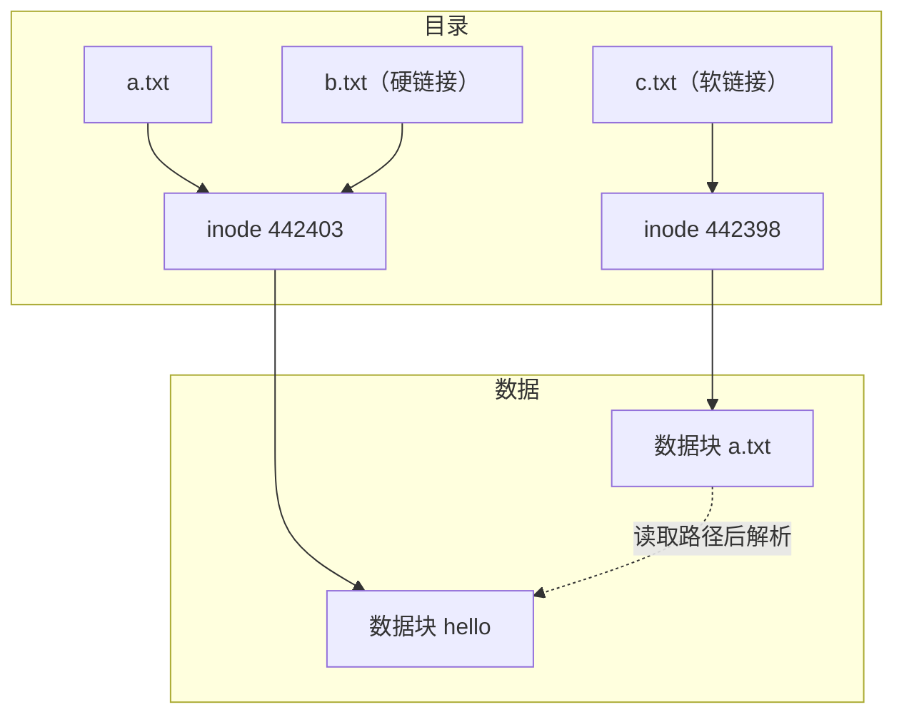

# 硬链接和软链接的区别--inode 详解

> OSTEP中说明：在文件系统中，关于存储虚拟化有两个抽象，第一个是文件，而文件的低级名称通常称为inode号。第二个抽象则是目录，它包含一个（用户可读名字，低级名字）对的列表。本文从 stat 命令出发，通过 ln、strace 一步步验证硬链接、软链接、删除的本质，并把这些现象跟 inode 的设计联系起来。

---

## 一、前言

日常学习时会产生几个现实中的疑问

1. 每当在目录里用 `ls -l` 看到的一大堆信息——大小、权限、时间——存在哪里？
2. 硬链接的本质到底是什么？跟软链接有什么区别？
3. `rm` 删文件，是真的"删掉"了吗？
 
这篇文章我通过理论加实验的方式对这些问题一一解答。


---

## 二、stat 命令--详细理解文件信息

平时查看文件信息最常用的是 `ls -l`：

```bash
rr@rr-VMware-Virtual-Platform:~/os_lab/inode_test$ ls -l a.txt
-rw-rw-r-- 1 rr rr 6 Jul 12 00:01 a.txt
```

这里能看到权限、硬链接数、所有者、大小、修改时间。但有一个最关键的信息没显示——**inode 号**。加 `-i` 参数就能看到：

```bash
rr@rr-VMware-Virtual-Platform:~/os_lab/inode_test$ ls -li a.txt
442403 -rw-rw-r-- 2 rr rr 6 Jul 12 00:01 a.txt
```

第一列的 `442403` 就是这个文件的 inode 号。每个文件都有一个唯一的 inode 号，可以理解为文件在文件系统中的**身份证号码**。

更详细的信息需要用 `stat` 命令：

```bash
rr@rr-VMware-Virtual-Platform:~/os_lab/inode_test$ stat a.txt
  File: a.txt
  Size: 6         	Blocks: 8          IO Block: 4096   regular file
Device: 811h/2065d	Inode: 442403      Links: 2
Access: (0664/-rw-rw-r--)  Uid: ( 1000/      rr)
Access: 2026-07-12 00:00:00.000000000 +0000
Modify: 2026-07-12 00:01:00.000000000 +0000
Change: 2026-07-12 00:01:05.000000000 +0000
```

每一行都是在读 inode 这个数据结构里的一个字段：

| stat 输出 | 里面的信息 |
|:---------|:-----------|
| Inode: 442403 | inode 号，C 里叫 `st_ino`，文件的身份证 |
| Size: 6 | 文件大小（`st_size`），单位字节 |
| Links: 2 | 硬链接数（`st_nlink`），有几个目录项指向这个 inode |
| 权限字 | 文件类型和权限（`st_mode`），0664 就是 -rw-rw-r-- |
| Uid/Gid | 所有者（`st_uid`）和所属组（`st_gid`） |
| 三个时间 | `st_atime` 最后访问 / `st_mtime` 最后修改 / `st_ctime` 最后状态变更 |
| Blocks: 8 | 磁盘占用（`st_blocks`），计数单位 512 字节，不是文件系统的分配单位 |

>  为什么不是 Blocks: 1？
> 文件系统按 4096 字节分配（IO Block），6 字节文件也得占一整块。`st_blocks` 只是个统计口径，单位固定是 512 字节（POSIX 遗留标准），所以显示 `4096 ÷ 512 = 8`。不是文件系统按 512字节 分配。

这里有一个细节：Links（硬链接数）显示为 2。普通文件刚创建时硬链接数应该是 1——这个值偏高是因为我在开始写这篇文章之前已经对这个文件做过硬链接实验，并非刚创建时的状态。

### 用 C 程序读取 inode 信息

命令行的 `stat` 本质上就是读取 inode 结构体。用 C 语言也可以做同样的事：
说明一下：inode 号和硬链接数不可能为负，所以用无符号 %lu；文件大小虽然也不为负，但 off_t 标准定义是有符号的（因为 lseek 需要支持负偏移），所以用 %ld。

```c
#include<stdio.h>
#include<sys/stat.h>

int main(){
    struct stat s;
    stat("a.txt", &s);
    printf("inode: %lu\n", s.st_ino);
    printf("size: %ld\n", s.st_size);
    printf("hard links: %lu\n", s.st_nlink);
    return 0;
}
```

编译运行：

```bash
rr@rr-VMware-Virtual-Platform:~/os_lab/inode_test$ gcc stat_test.c -o stat_test && ./stat_test
inode: 442403
size: 6
hard links: 2
```

C 语言的 `struct stat` 和磁盘上的 inode 结构是对应的——当你调用 `stat()` 时，内核从 inode 缓存（若未缓存则先从磁盘读到缓存）读取 inode 结构体，填充这个结构体返回给用户态。

---

## 三、文件名的误区

很多人会下意识地认为"文件名就是文件"。但通过上面的 stat 输出可以意识到一个问题：**文件名并没有出现在 inode 里。**

inode 存的是大小、权限、时间、数据块位置——但不存文件名。

在文章开头介绍了**目录**包含了用户可读名字，所以文件名存放在目录里。

然而目录本质上也是一个文件，也有自己的 inode。但目录的数据块内容很特殊——它存的是一张映射表：

```
文件名 → inode号
```

`/` 目录的结构大致如下：

```
.      → 2       （当前目录）
..     → 2       （父目录，根目录的父目录也是自己）
home   → 12345
usr    → 67890
tmp    → 11111
```

这就是为什么 inode 里没有文件名——**文件名是属于目录的，不属于文件本身**。同一个 inode 可以有多个文件名，这就是硬链接。

用图来表示这三者的关系：



流程：目录项存文件名→inode号 → inode存元数据+数据块指针 → 数据块存真正内容。

### 目录的底层实现：不只是简单列表

把目录看作一张"文件名→inode号"的映射表，在概念上是正确的。但不同文件系统实际存储这张表的方式不同。

**ext4 用线性列表**。目录的数据块中按顺序存放一个个条目，每个条目包含 inode 号、文件名的长度和文件名本身。要查找一个文件，ext4 从头到尾扫描这个列表，逐个比较文件名。目录中的文件越多，查找就越慢（O(n) 复杂度）。所以如果一个目录下放几十万个小文件，性能会显著下降。

**XFS 用 B 树索引**。XFS 在目录较大时自动把线性列表转换成 B 树结构，查找复杂度降到 O(log n)。所以在 XFS 上，即使一个目录下有百万个文件，创建和查找的性能依然稳定。

这个差异在面试中可能会被问到。一个简单的验证方式：在 ext4 和 XFS 上分别创建大量文件，对比 `ls` 的响应时间。

但无论底层怎么存，目录对外暴露的抽象始终没变——文件名到 inode 号的映射。上层应用不需要关心它是线性扫描还是 B 树查找。

---

## 四、硬链接：同一个 inode 的多个名字

### 4.1 实验

```bash
rr@rr-VMware-Virtual-Platform:~/os_lab/inode_test$ echo "hello" > a.txt
rr@rr-VMware-Virtual-Platform:~/os_lab/inode_test$ ln a.txt b.txt    # 创建硬链接
rr@rr-VMware-Virtual-Platform:~/os_lab/inode_test$ ls -li
442403 -rw-rw-r-- 2 rr rr 6 Jul 12 00:01 a.txt
442403 -rw-rw-r-- 2 rr rr 6 Jul 12 00:01 b.txt
```

两个文件 inode 号相同，都是 442403。这说明 **a.txt 和 b.txt 根本就是同一个文件**——只是两个名字指向同一个 inode。

注意看硬链接数列：`ls -l` 的第二列从 1 变成了 2。这个数字就是 inode 里 nlink 记录的硬链接引用计数，表示有多少个目录项指向这个 inode。

### 4.2 测试删除原文件对硬链接的影响

```bash
rr@rr-VMware-Virtual-Platform:~/os_lab/inode_test$ rm a.txt
rr@rr-VMware-Virtual-Platform:~/os_lab/inode_test$ ls -li
442403 -rw-rw-r-- 1 rr rr 6 Jul 12 00:01 b.txt
rr@rr-VMware-Virtual-Platform:~/os_lab/inode_test$ cat b.txt
hello
```

`a.txt` 被删了，但 `b.txt` 还在，内容完好。因为 `rm a.txt` 只是**删除了指向 inode 442403 的一个目录项**，nlink 从 2 减为 1。inode 还在，数据块还在，通过 b.txt 照样可以访问。

### 4.3 硬链接的本质

简单来说：**硬链接不是创建文件，而是创建一个新的目录项，指向已有的 inode。**



创建硬链接后，两个目录项指向同一个 inode，共享同一份数据。

### 4.4 硬链接的限制

1. **不能跨文件系统**。因为 inode 号只在当前文件系统内唯一，不同文件系统的 inode 号是各自独立管理的，同一个编号可能指向完全不同的文件。
2. **不能链接目录**。假设现在有个目录 `/home/user/projects/`，如果允许对它建硬链接，在 projects 里建一个指向根目录 `/` 的硬链接：

   ```
   /home/user/projects/root  →  /
   ```

   然后从根目录遍历：

   ```
   /  →  /home/  →  /user/  →  /projects/  →  /root（又回到 /）
                                                  →  /home/  →  ……
   ```

   `find`、`du`、`rm -rf` 一旦陷入循环就跳不出来了。所以 POSIX 禁止对目录建硬链接。

   `.` 和 `..` 虽然也是目录硬链接，但那是内核自己维护的，遍历时内核会识别并直接跳过。自己个人建的目录硬链接内核没法区分，只能往下继续遍历，必然会陷入循环。

---

## 五、软链接：存路径的独立文件

### 5.1 实验

```bash
rr@rr-VMware-Virtual-Platform:~/os_lab/inode_test$ ln -s a.txt c.txt    # 创建软链接
rr@rr-VMware-Virtual-Platform:~/os_lab/inode_test$ ls -li
442403 -rw-rw-r-- 1 rr rr 6 Jul 12 00:01 a.txt
442398 lrwxrwxrwx 1 rr rr 5 Jul 12 00:01 c.txt -> a.txt
```

注意区别：**c.txt 的 inode 号是 442398，跟 a.txt（442403）完全不同。** 文件类型显示为 `l`（link），大小只有 5 个字节——正好是目标文件名 "a.txt" 的长度。

### 5.2 软链接数据块内容

```bash
rr@rr-VMware-Virtual-Platform:~/os_lab/inode_test$ cat c.txt
hello
```

通过软链接访问到了内容。但如果看它本身的数据，其实是路径字符串：

```bash
rr@rr-VMware-Virtual-Platform:~/os_lab/inode_test$ readlink c.txt
a.txt
```

软链接的工作原理可以用图说清：



c.txt 是一个独立文件，它的数据块存的是路径字符串 "a.txt"。

### 5.3 测试删除原文件对软链接的影响

```bash
rr@rr-VMware-Virtual-Platform:~/os_lab/inode_test$ rm a.txt
rr@rr-VMware-Virtual-Platform:~/os_lab/inode_test$ cat b.txt    # 硬链接
hello
rr@rr-VMware-Virtual-Platform:~/os_lab/inode_test$ cat c.txt    # 软链接
cat: c.txt: No such file or directory
```

硬链接还能访问，软链接报错——因为原文件的路径不存在了。详细来说，cat c.txt 时读取 c.txt 的数据块，也就是拿到了字符串 a.txt，然后再从目录中根据文件名和 inode 号映射找对应的 inode 号，但是此时已经 remove 了 a.txt，所以找不到对应的 inode 号，进而报错。这就是所谓的**悬空引用（dangling reference）**。

### 5.4 硬链接、软链接特点与对比

| 维度 | 硬链接 | 软链接 |
|:----|:-------|:-------|
| inode 号 | 与原文件相同 | 独立 inode |
| 数据块 | 共享（不占额外数据空间） | 存路径字符串（占少量数据空间） |
| nlink（硬链接数） | 增加原 inode 的引用计数 | 不影响原文件 |
| 跨文件系统 |  不能 |  可以 |
| 链接目录 |  不能（POSIX 禁止） |  可以 |
| 原文件被删 | 还在（引用计数 > 0） | 悬空（路径失效） |
| `ls -li` 表现 | 同 inode 号 | 不同 inode 号，显示 `->` |

一张图汇总三者的关系：



---

## 六、删除(rm)的本质

### 6.1 strace 观察

```bash
rr@rr-VMware-Virtual-Platform:~/os_lab/inode_test$ strace rm b.txt 2>&1 | grep unlink
unlinkat(AT_FDCWD, "b.txt", 0) = 0
```

`rm` 的底层是 `unlinkat` 系统调用（新版本 Linux 用 unlinkat 替代了早期的 unlink）。该调用做了两件事：
1. 从目录中删除 "b.txt" 这个映射条目
2. 将 inode 442403 的 nlink 减 1

此时 nlink 从 1 变成 0，如果满足以下两个条件，内核才会真正释放这个 inode 和数据块：
- nlink == 0（没有目录项指向它）
- 没有进程持有这个文件的文件描述符（没有进程正在读写它）

这也解释了为什么有时磁盘空间没释放——可能是一个进程仍然持有已删除文件的 fd。

### 6.2 用 strace 验证 cp 和 mv 的底层操作

继续实验，对比 cp 和 mv：

```bash
rr@rr-VMware-Virtual-Platform:~/os_lab/inode_test$ echo "hello" > a.txt
rr@rr-VMware-Virtual-Platform:~/os_lab/inode_test$ strace cp a.txt d.txt 2>&1 | grep -E 'openat.*\.txt'
openat(AT_FDCWD, "a.txt", O_RDONLY)     = 3
openat(AT_FDCWD, "d.txt", O_WRONLY|O_TRUNC) = 4
```

cp 创建了一个新的 inode（`d.txt`），打开了源文件（`a.txt`），从源文件读数据，写入新文件，数据被完整复制了一遍。
因为 grep 只过滤了 openat 的行，所以没有看到调用 read/write 的语句，若想查看，可执行：
```bash
 strace cp a.txt d.txt 2>&1 | grep -E 'read|write'  
```

```bash
rr@rr-VMware-Virtual-Platform:~/os_lab/inode_test$ strace mv d.txt e.txt 2>&1 | grep rename
renameat2(AT_FDCWD, "d.txt", AT_FDCWD, "e.txt", RENAME_NOREPLACE) = 0
```

mv 只调了一个 rename 系统调用——没有读数据也没有写数据，只是在目录中改了文件名。这也说明了 mv 命令无论文件有多大，都能快速执行。

这里有一个边界情况：**跨文件系统的 mv 相当于 cp + rm**。因为 rename 无法跨文件系统操作，系统会退化成"复制到目标位置→删除原文件"，inode 号会发生变化。

---

## 七、排查场景

理论归理论，在实践中可能会碰到以下场景：

**磁盘空间没释放**——`df -h` 显示满了但找不出大文件。用 `lsof | grep deleted` 排查，看是否有进程持有了已删除文件的 fd。原因就是文章讲的：nlink 归零但 fd 还在，内核不释放。

**硬链接数异常**——`stat` 看到 nlink 比你预期的多。用 `find / -inum <inode号>` 找出所有指向这个 inode 的文件名，看看多了哪个硬链接。

**软链接断裂**——`ls -l` 看到一堆红底白字的链接。用 `find -L /path -type l` 批量列出所有悬空引用，然后决定是删掉还是重建目标文件。

---

## 八、总结

读完本文之后，即可解决开头的几个问题：

1. **`ls -l` 看到的大小、权限、时间存在哪里**——存在 inode 里。`stat` 命令输出的每一行，本质上都是读 inode 结构体里的一个字段。

2. **硬链接的本质是什么，跟软链接有什么区别**——硬链接不是创建文件，而是在目录中新增一个条目指向已有 inode，nlink 加 1，删除原文件后数据依然可访问。软链接是创建一个独立文件（类型 `l`），数据块存放的是目标路径字符串，`cat` 时先读 c.txt 的数据块拿到 "a.txt"，再去目录查找 a.txt 的 inode，然后读取数据；若原文件已被删除，路径解析失败即报错。

3. **rm 删文件到底删了什么**——删目录项，inode 引用计数（nlink）减 1。只有 nlink 归零且没有进程持有文件描述符（fd）时，内核才真正释放磁盘空间。

本文是作者关于操作系统文件系统的第一篇文章。本文涉及到 inode 结构，硬链接和软链接的本质。但这只是文件系统的一小部分。后续会继续推进关于文件系统的相关博客，一步步往深了走，把这块彻底聊透。

